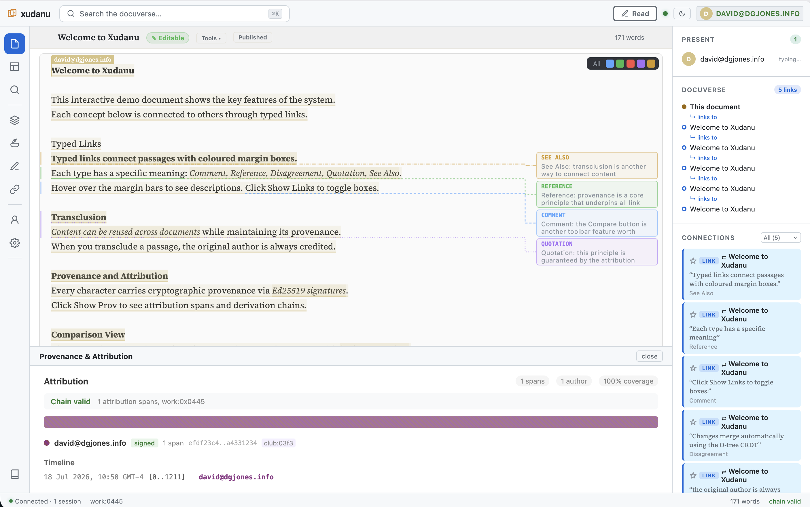

# xudanu



> **[Read the documentation](https://dgjones.info/xudanu/)** — user guides, technical architecture, and visual diagrams.
> **[Source on GitHub](https://github.com/jonesd/xudanu)** — releases with static binaries for Linux, macOS, and Windows.
> **[Docker image](https://github.com/jonesd/xudanu/pkgs/container/xudanu)** — `ghcr.io/jonesd/xudanu`, multi-arch, rebuilt on every release.

**xudanu** (Xudanu) is a modern Rust and TypeScript implementation inspired by the Xanadu Project and its Udanax Gold (Xanadu 92.1) system.

> **Disclaimer:** Xudanu is an independent, open-source project (Apache 2.0).
> It is not affiliated with, endorsed by, or sponsored by Ted Nelson,
> Project Xanadu&trade;, the Xanadu Operating Company, Autodesk Inc., or the
> Udanax development team. All trademarks belong to their respective owners.

---

## What Xudanu does differently

- **Visible typed links** — Six link types (Comment, Reference, Disagreement, Quotation, See Also, Web) with coloured description boxes and connecting lines
- **Real transclusion** — Content from one document appears live in another, with provenance tracing back to the source
- **Real-time CRDT collaboration** — Multiple users editing the same document without locks
- **Transcopyright licensing** — First system to natively support Ted Nelson's Transcopyright License (TCo). Per-work license metadata with compliance badges and attribution stamping
- **Cross-server federation** — Documents link across independent servers via BLAKE3-verified tumblers
- **Compound document builder** — Assemble new documents from passages of existing works
- **Image support** — Upload, crop, resize, caption persistence, layout mode with inline positioning
- **Perspective view** — Spatial document landscape showing connected works

---

## Naming

The canonical name of the project is **`xudanu`** (lowercase).

* Used for: code, crates, CLI tools, and repository naming
* Example: `use xudanu::...`, `xudanu serve`

The capitalized form **“Xudanu”** may be used in prose or discussion when referring to the system more generally.

---

## Overview

The original Xanadu work introduced a deeply innovative model for structured documents, versioning, and linking.
xudanu continues that lineage by:

* Translating core ideas into **Rust**
* Supporting **WebAssembly (WASM)** execution
* Refining and optimizing core data structures and algorithms
* Making the system usable in modern environments (web, services, distributed systems)

This is not just a port—it is an **evolution** of those ideas.

---

## Lineage

xudanu builds on a long lineage of research and engineering:

```
Xanadu Project (1960s–1990s)
        ↓
Xanadu 92.1 (Udanax Gold)
        ↓
xudanu (Rust / WebAssembly)
```

The original Xanadu system explored new models for hypertext, identity, and structure that remain relevant today.

The Udanax Gold source code was released open-source on August 23, 1999 under the MIT/X11 license. See [udanax.xanadu.com](http://udanax.xanadu.com/) for the original announcement, license, and supporting documents.

---

## Project Background

The Xanadu project, initiated in the 1980s, explored a radically different approach to hypertext and information systems.
Its implementation, Xanadu 92.1 (later released as Udanax Gold), introduced novel data structures and models.

xudanu is a modern reimplementation and evolution of those ideas.

This project:

* Translates and adapts concepts from Udanax Gold into Rust
* Introduces optimizations and architectural changes
* Targets modern execution environments including WebAssembly

We aim to preserve the strengths of the original system while making it usable in today’s ecosystem.

---

## Philosophy

xudanu exists to continue and extend ideas that were ahead of their time.

By combining those foundational concepts with modern tools such as Rust and WebAssembly, we aim to:

* Improve safety and performance
* Enable new applications
* Support experimentation and real-world deployment

This project is an ongoing evolution, not a static port.

---

## Status

**Developer Preview** — the system is functional and tested (2,500+ tests passing) but APIs and data formats may evolve. Snapshot migration ensures your data survives upgrades. Versioned wire protocol supports backward-compatible API changes.

**[Feature Status](original-code/xanadugold/src-rust/docs/feature-status.md)** — comprehensive tracking of all Xanadu, Udanax Gold, and Xudanu features with implementation status. Covers Nelson's 17 Rules, core data structures, wire protocol, frontend, security, federation, and Xudanu-exclusive additions (LLM integration, cryptographic provenance, CRDT collaborative editing).

## Quick Start

The common scenarios, in the order people actually hit them.

**Before you start (all scenarios):**

- **Docker running** — check with `docker info` in a terminal. If it
  hangs or errors, start Docker Desktop (macOS/Windows) or the
  `docker` service (Linux). If `docker info` hangs for more than ~10
  seconds, the daemon is unresponsive: quit Docker Desktop completely
  and relaunch it.
- **Port 8080 free** — check with `lsof -i :8080` (macOS/Linux) or
  `netstat -an | findstr 8080` (Windows). If something else is
  listening, stop it or change the port mapping in the compose file
  (left side of `"8080:8080"`).
- That's it — no database, no API keys, no configuration files.

### Scenario 1 — Try it (2 minutes, nothing to install)

```bash
curl -O https://raw.githubusercontent.com/jonesd/xudanu/main/docker-compose.single.yml
docker compose -f docker-compose.single.yml up -d
```

Open `http://localhost:8080`. Create a document, select some text,
make a link. Data persists in a named volume — `docker compose -f
docker-compose.single.yml down` to stop (`-v` also deletes the data).

No Docker? Grab a static binary from
[releases](https://github.com/jonesd/xudanu/releases) — Linux (musl),
macOS (Apple Silicon + Intel), Windows — and:

```bash
./xudanu-server run 127.0.0.1:8080 ./data
```

### Scenario 2 — Your personal notes server (the 90% case)

Same single-node setup as Scenario 1, run on your VPS/home server
behind HTTPS. Point the compose at a persistent directory, put your
domain in front with any reverse proxy (Caddy example):

```
yourdomain.com {
    reverse_proxy localhost:8080
}
```

Your notes, your machine, no cloud. Works offline; federation is
opt-in and off by default.

**Where your data lives.** The compose stores everything in a named
Docker volume (`xudanu-data`) — on your disk, in documents/links/
chunks/revisions/provenance. Nothing leaves the machine.

**If you prefer a visible directory** (rsync-able, easy to inspect),
swap the volume line in the compose for a bind mount:

```yaml
    volumes:
      - ./xudanu-data:/data
```

**Backup** (works for either storage style):

```bash
docker run --rm -v xu-gold-2026_xudanu-data:/data \
  -v $(pwd):/backup alpine tar czf /backup/xudanu-data.tar.gz /data
```

**Update** to the latest image — your data is untouched:

```bash
docker compose -f docker-compose.single.yml pull
docker compose -f docker-compose.single.yml up -d
```

### Scenario 3 — Collaborative writing (team/lab/class)

Still one server — Xudanu is multi-user by design. Share the URL;
people create identities, write simultaneously (CRDT-based live
editing), and every passage carries its author's signed provenance.
Set `--edit-policy public-sandbox` for a wiki-style instance, or
keep the default owner-only policy with per-work permissions.

### Scenario 4 — Try federation (the demo, not the deployment)

Three servers on one machine to see the network features — search
across servers, pull a passage by reference from another node,
watch it update when the source edits:

```bash
git clone https://github.com/jonesd/xudanu.git && cd xudanu
docker compose -f docker/docker-compose.yml up --build -d
# Node 1: http://localhost:8081 · Node 2: :8082 · Node 3: :8083
```

Real multi-server deployments use the same image on separate
machines with `--peer <address>` and `--trusted-peer-key <key>` —
see the [network guide](https://dgjones.info/xudanu/).

### Scenario 5 — From source (developers)

```bash
git clone https://github.com/jonesd/xudanu.git && cd xudanu
cargo build --features server -p xudanu
# In-memory (no persistence):
./target/debug/xudanu-server run 127.0.0.1:8080
# With persistent storage:
./target/debug/xudanu-server init ./data
./target/debug/xudanu-server run 127.0.0.1:8080 ./data
```

The Docker image (`ghcr.io/jonesd/xudanu`, multi-arch amd64+arm64)
is rebuilt every release: `latest`, `stable`, `1.7`, `edge` (main).

### macOS Users

If you downloaded a pre-built binary and see "Apple could not verify xudanu-server":

```bash
xattr -cr /path/to/xudanu-server
```

Or right-click the binary → Open → click Open again in the dialog.

### 4. Open in your browser

Go to **http://127.0.0.1:8080** — you'll see the document editor.

### 5. (Optional) Enable LLM features

**Everything above works without any AI components.** LLM features
are entirely opt-in: document summarization, writing feedback, title
suggestions, and auto-tagging. When enabled, they use a local LLM
via [Ollama](https://ollama.ai) — no API keys, no cloud accounts,
no data leaves your machine. If Ollama isn't running, Xudanu simply
disables these features; the core system is unaffected.

**Install Ollama:**

```bash
# macOS
brew install ollama
ollama serve &

# Linux
curl -fsSL https://ollama.ai/install.sh | sh
```

**Pull a model:**

```bash
# Small and fast (recommended for testing):
ollama pull qwen2.5:1.5b

# Larger, better quality:
ollama pull qwen2.5:7b
# or
ollama pull llama3.1:8b
```

**Start the server with LLM enabled:**

```bash
OLLAMA_BASE_URL=http://localhost:11434 \
OLLAMA_MODEL=qwen2.5:1.5b \
./target/debug/xudanu-server run 127.0.0.1:8080 data \
  --allowed-origin http://localhost:5173 \
  --csrf-token
```

Or use the included script:

```bash
cd original-code/xanadugold/src-rust
./scripts/start-llm.sh
```

Once enabled, open any document and you'll see gold sparkle buttons in the format bar:

| Feature | Description |
|---|---|
| **Summarize** | Describes what changed between document versions |
| **Feedback** | AI writing coach — clarity, structure, persuasiveness |
| **Title** | Generates a title from document content |
| **Auto-Tag** | Suggests concept tags, creates links to existing concepts |

LLM-authored text is tagged with gold/amber attribution in the provenance panel.

### Next steps

- **[Technical Architecture](http://dgjones.info/xudanu/technical-architecture.html)** — a detailed walkthrough of the core data structures, algorithms, and performance characteristics (O-trees, GrandMap, Canopy pruning, H-trees, transclusion queries, DagWood concurrent edits). Recommended for all developers and architects.
- [Xudanu in One Page](http://dgjones.info/xudanu/xudanu-in-one-page.html) — a concise overview of the entire system.
- [30 Years of Hypertext Innovation](http://dgjones.info/xudanu/30-years-of-hypertext-innovation.html) — historical context connecting Xanadu to modern hypertext.
- [Storage System](http://dgjones.info/xudanu/storage-system.html) — content-addressed chunk store and manifest design.
- [Notification System](http://dgjones.info/xudanu/notification-system.html) — content watch, similarity matching, and micropayments.
- [All documentation](http://dgjones.info/xudanu/) — index of all available docs.
- [Server README](original-code/xanadugold/src-rust/README.md) — CLI reference, web UI guide, TLS setup, federation, and architecture details.

---

## Federation & Clustering

Xudanu runs as a single server on a laptop, but it also supports **multi-machine federation** — a cluster of independent peer nodes that replicate content, converge membership, and make cluster-wide decisions via PBFT consensus.

**What works today (v0.8.1):**
- Outbound dialer with automatic reconnect (exponential backoff)
- Mutual Ed25519/X25519 handshake with ChaCha20-Poly1305 encrypted channels
- Content replication (BLAKE3-verified, CRDT-convergent — duplicates are harmless)
- Membership convergence via web-of-trust endorsements
- PBFT governance broadcast for cluster-wide decisions
- Self-healing: a partitioned or crashed node catches up automatically on return

**Try it with Docker (3-node cluster):**

```bash
docker compose up --build
# Peer A: http://localhost:8081
# Peer B: http://localhost:8082
# Peer C: http://localhost:8083
```

Each peer is a full node (web UI + client WS + federation WS). Upload a document on one peer — it appears on the others within seconds.

**Manual two-node setup:**

```bash
# Peer A — logs its verifying key at startup
xudanu-server run 127.0.0.1:8081 data-a \
  --peer 127.0.0.1:8082 \
  --trusted-peer-key <B's verifying key>

# Peer B — registers A's key
xudanu-server run 127.0.0.1:8082 data-b \
  --peer 127.0.0.1:8081 \
  --trusted-peer-key <A's verifying key>
```

**Scaling:** 3-10 peers on VPS or donated machines works out of the box (full-mesh replication). Beyond 20 nodes, incremental sync and gossip relay are on the roadmap.

**Full guide:** [Federation Activation](http://dgjones.info/xudanu/federation-activation.html) — PBFT explained, broadcast/sync diagrams, chunk replication flow, failure recovery scenarios, scaling estimates, and a problem checklist by cluster size.

---

## Documentation Deployment

Documentation is served at **[dgjones.info/xudanu/](https://dgjones.info/xudanu/)** via GitHub Pages.

- **Workflow:** `.github/workflows/deploy-docs.yml`
- **Trigger:** Any push to `main` that changes files in `docs/**`
- **Source:** The entire `docs/` directory is uploaded as the Pages artifact
- **No build step** — static HTML/Markdown served as-is

To add or update documentation:

1. Add/edit files in `docs/` (HTML files match the dark theme; Markdown files in `docs/dev/`)
2. If adding a new page, link it from `docs/index.html`
3. Commit and push to `main` — GitHub Actions deploys automatically

---

## License

xudanu is licensed under the **Apache License 2.0**.

### Upstream License

Portions of this project are derived from **Udanax Gold (Xanadu 92.1)**, which was released under the **Xanadu X11 license** (a permissive license similar to MIT).

The original license is included in:

```
original-code/xanadugold/LICENSE
```

### Commercial Use

Both licenses are permissive.

This means you may:

* Use this software commercially
* Modify and distribute it
* Integrate it into proprietary systems

Requirements:

* Preserve license notices
* Include attribution to the original Xanadu/Udanax work

---

## Disclaimer

Xudanu is an independent, open-source project. It is not affiliated with, endorsed by, or sponsored by Ted Nelson, Project Xanadu™, the Xanadu Operating Company, Autodesk Inc., or the Udanax development team. Xudanu implements concepts from the open-sourced Udanax-Gold codebase (released 1999 under the Xanadu X11 license) using original code. "Xanadu" is a project name of Ted Nelson. All trademarks belong to their respective owners.

---

## Contributing

Contributions are welcome.

By contributing, you agree that your contributions will be licensed under the Apache License 2.0.

---

## Acknowledgements

We acknowledge the original Xanadu vision and the engineers who built Udanax Gold.
Their work continues to influence how we think about information systems today.

