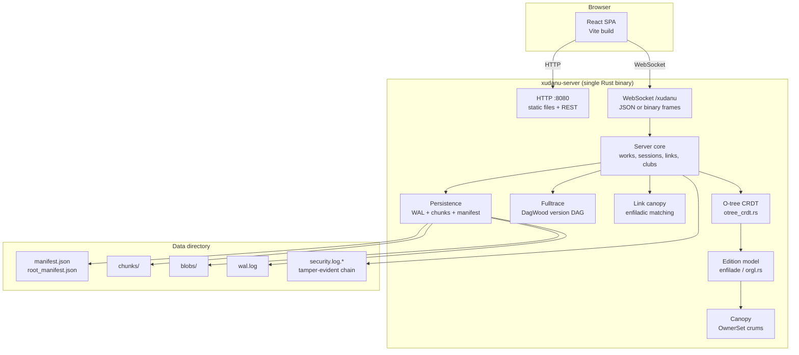
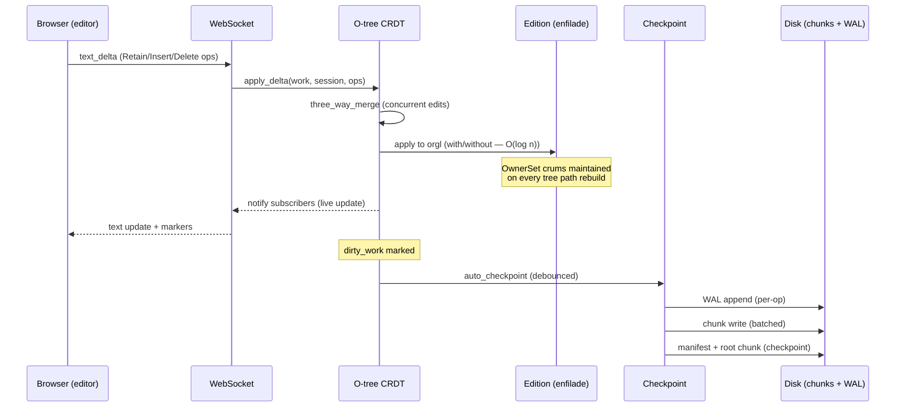
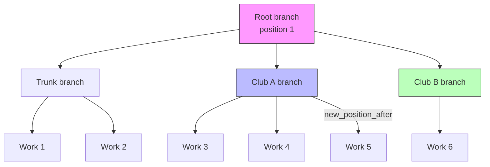

# Xudanu Architecture

> Status: reference · Created: 2026-09-05
> Scope: the full system — what runs where, how data flows, and
> how the Gold heritage maps to our modules.
>
> Companion docs: `docs/dev/` (FR feature requirements),
> `docs/gold-link-model.md` (the link model archaeology).

## 1. System context — the two trees

```
xu-gold-2026/                      (workspace root)
├── original-code/xanadugold/      Gold C++ source (read-only heritage)
├── original-code/xanadugold/
│   └── src-rust/                  BACKEND — Rust (~140k lines, 148 files)
│       ├── src/                   the crate
│       ├── tests/                 integration tests
│       └── Cargo.toml
└── web/app/                       FRONTEND — TypeScript/React (~150 files)
    ├── src/
    │   ├── api/                   WS client, CRDT sync, text buffer
    │   ├── components/            editor, panels, wizards
    │   ├── hooks/                 useCrdtSync, useTransclusion
    │   └── __tests__/             vitest specs
    └── package.json
```

**One process serves everything**: `xudanu-server` is a single
Rust binary that serves the built frontend (static files) AND the
WebSocket/HTTP API on the same port. No separate frontend server
needed in production.

## 2. Runtime layout



### Development vs production

| Mode | Frontend | Backend | How |
|---|---|---|---|
| Dev | Vite :5173 (HMR) | Rust :8080 | `./scripts/restart.sh` |
| Prod | Embedded in binary | Rust :8080 | `xudanu-server run <addr> <dir>` |
| Prod + static | `--static-dir` (serves dist/) | Rust :8080 | One binary + built frontend |

## 3. Backend module map — the layers

```mermaid
graph TB
    subgraph "Transport (server/transport/)"
        HANDLER[handler.rs<br/>WS connection lifecycle]
        DISPATCH[dispatch.rs<br/>op routing]
        CODEC[codec.rs<br/>JSON/binary frame codec]
        PROTOCOL[protocol.rs<br/>payload types]
        OAUTH[oauth.rs<br/>GitHub/Google auth]
    end

    subgraph "Server core (server/)"
        SERVER[server.rs<br/>~45k lines — the Server struct,<br/>works, links, sessions, clubs,<br/>checkpoint, restore, CRDT mgmt]
        SESSION[session.rs<br/>auth, clubs, tickets]
        IDENTITY[identity.rs<br/>club credentials]
        FEDERATION[federation.rs<br/>peer mesh, governance]
        SEED[seed_demo.rs<br/>--seed-links-demo]
    end

    subgraph "Edition model (edition/)"
        EDITION[edition.rs<br/>the Edition type —<br/>the user-visible document]
        ORGL[orgl.rs<br/>the enfilade — Loaf tree<br/>with per-node crums, OwnerSets]
        LINKS[links.rs<br/>HyperLink, HyperRef,<br/>end-sets, SpanRef]
        LINKCANOPY2[link_canopy.rs<br/>enfiladic link matching]
        BACKFOLLOW[backfollow.rs<br/>content-reuse index,<br/>recorders, canopy crums]
        CANOPY2[canopy.rs<br/>Gold canopy crum tree<br/>(mutable, for backfollow)]
        PROPS[props.rs<br/>BertProp permissions algebra]
        HOIST[hoist.rs<br/>widdershin — bottom-up<br/>crum propagation]
        DERIVED[derived.rs<br/>DerivedSpec — virtual works]
        TRANSCL[transclusion.rs<br/>structural transclusion]
        COMPOUND[compound.rs<br/>CompoundEdition]
        NOTARIZE[notarize.rs<br/>RangeNotarization<br/>Ed25519 range proofs]
    end

    subgraph "Space algebra (space/)"
        SPACE[space.rs<br/>Position, Region, Dsps]
        LATTICE[lattice.rs<br/>FR-51 weight-balanced tree<br/>the tumbler-native store]
        SEQUENCE[sequence.rs<br/>Sequence ordering]
        CROSS[cross.rs, cross_n.rs<br/>CrossSpace2 product spaces]
        TUMBLER[tumbler.rs<br/>XudanuTumbler addresses]
    end

    subgraph "Entity tree (ent/) — FR-52 A-1"
        DAGWOOD[dagwood.rs<br/>version DAG — branch points,<br/>partial order, trace_view]
        BRANCH[branch.rs<br/>BranchStore, BranchKind]
        TRACE[trace.rs<br/>TracePosition]
        ENT[ent.rs<br/>the Ent — owns the DagWood]
    end

    subgraph "Persistence (persist/)"
        CHUNKSTORE[chunk_store.rs<br/>content-addressed chunks]
        WAL2[wal.rs<br/>write-ahead log]
        MANIFEST2[manifest.rs<br/>JSON manifest]
        ROOTCHUNK[root_chunk.rs<br/>FR-44 chunk-tree manifest]
        SNAPSHOT[snapshot.rs<br/>full-state snapshots]
    end

    subgraph "Crypto (crypto/)"
        KEYS[keys.rs<br/>server keypair, history]
        KDF[kdf.rs<br/>domain-separated derivation]
        AEAD[aead.rs<br/>ChaCha20-Poly1305]
    end

    TRANSPORT --> SERVER
    SERVER --> EDITION
    SERVER --> LINKS
    SERVER --> FEDERATION
    EDITION --> ORGL
    EDITION --> SPACE
    EDITION --> ENT
    LINKS --> LINKCANOPY2
    LINKS --> BACKFOLLOW
    BACKFOLLOW --> CANOPY2
    CANOPY2 --> PROPS
    CANOPY2 --> HOIST
    SERVER --> PERSIST
    EDITION --> PERSIST
    SERVER --> CRYPTO
```

## 4. How an edit flows through the system



### The enfilade in one paragraph

Every Edition is backed by an **orgl** — an immutable (copy-on-write)
tree of **Loaves** (`Leaf | Split | Dsp`). Each node carries:
- a **content crum** (BLAKE3 hash — O(1) equality via the FR-34 fast path)
- an **OwnerSet** (distinct owner clubs from provenance — the A-3 canopy)
- a **char_len** (the char-space extent for descent pruning)
- a **domain** (the XnRegion this subtree covers)

Edits rebuild only the O(log n) path from root to the changed leaf
(`with`/`without` operations). Structural sharing via `Arc` means
unedited subtrees are shared across editions at zero cost.

## 5. The link model (FR-40)

```mermaid
graph LR
    subgraph "One HyperLink"
        LT[LeftEnd<br/>end-set of HyperRefs]
        RT[RightEnd<br/>end-set of HyperRefs]
        NE[NamedEnd "Context"<br/>end-set of HyperRefs]
    end

    LT -->|attachment| W1[Work A, span 0-10]
    LT -->|attachment| W2[Work A, span 40-50]
    RT -->|attachment| W3[Work B, span 0-5]
    NE -->|attachment| W4[Work C, span 0-3]

    subgraph "Link canopy (enfiladic matching)"
        TREE[work-range arena tree<br/>OR-ed type bits]
    end

    TREE -->|prunes subtrees| LT
    TREE -->|prunes subtrees| RT
```

**Key concepts:**
- A link is a **sentence with blanks**: the type is the verb, each
  end fills one blank, a gathered end fills one blank *jointly*
- End-sets are unordered (Gold's IDSpace semantics)
- `LinkAttachment` refs target other links (links-to-links, S7)
- The link canopy prunes query subtrees by work-range and type bits

## 6. The fulltrace (FR-52 A-1) — the version DAG



- Every work gets a `TracePosition` = `(branch, position)` at creation
- Clubs get their own branches; club-owned works allocate on them
- `is_le(a, b)` — the partial order ("a is visible from b")
- `trace_view(reference)` — "the history visible from R"
- BeId stays the primary key — the fulltrace is a parallel index

## 7. Technology summary

| Concern | Technology | Why |
|---|---|---|
| Server language | Rust | safety, performance, no GC pauses for the enfilade |
| Async runtime | tokio | WS connections, HTTP serving, background checkpoint |
| Web framework | axum 0.8 | type-safe routing, WebSocket support |
| CRDT | custom O-tree | purpose-built for Xudanu's content model |
| Serialization (wire) | postcard | compact binary for WS frames |
| Serialization (manifest) | serde_json | human-readable, debuggable |
| Content hashing | BLAKE3 | fast, parallel, cryptographically strong |
| Crypto | ChaCha20-Poly1305, Ed25519, X25519 | modern, audited |
| Frontend | React 19 + TypeScript | component model, type safety |
| Build | Vite 8 | fast HMR, tree-shaking |
| Frontend tests | Vitest | fast, ESM-native |
| Backend tests | cargo test | 3400+ tests |
| Persistence | chunks + WAL + root chunk manifest | content-addressed, crash-safe |

## 8. What runs where (the one-page answer)

```
┌─────────────────────────────────────────────────┐
│ xudanu-server (single process, port 8080)       │
│                                                 │
│  ┌──────────┐  ┌──────────┐  ┌───────────────┐ │
│  │ HTTP API │  │ WebSocket│  │ Static files  │ │
│  │ /api/*   │  │ /xudanu  │  │ (built React) │ │
│  └────┬─────┘  └────┬─────┘  └───────────────┘ │
│       │              │                          │
│  ┌────▼──────────────▼──────────────────────┐  │
│  │           Server core                    │  │
│  │  works · links · clubs · sessions        │  │
│  │  O-tree CRDT · enfilade · canopy         │  │
│  │  fulltrace · link canopy                 │  │
│  └──────────────────┬──────────────────────┘  │
│                     │                          │
│  ┌──────────────────▼──────────────────────┐  │
│  │           Persistence                   │  │
│  │  WAL (per-op) → chunks (batched)        │  │
│  │  → root chunk manifest (checkpoint)     │  │
│  └──────────────────┬──────────────────────┘  │
│                     │                          │
│  ┌──────────────────▼──────────────────────┐  │
│  │           Data directory                │  │
│  │  data/manifest.json · chunks/ · blobs/  │  │
│  │  wal.log · security.log.* · keys        │  │
│  └─────────────────────────────────────────┘  │
└─────────────────────────────────────────────────┘
```

## 9. Development tooling (NOT part of the product)

| Tool | Used by | Purpose |
|---|---|---|
| `cargo` | developers | Rust build, test, clippy |
| `npm` / `vite` | developers | Frontend build, test |
| `bash` scripts | developers | restart, seed, deploy, screenshots |
| `node` scripts | developers | WebSocket seeding (demo corpus) |
| `python3` | AI assistant | file editing (search/replace on source files) |
| `git` | everyone | version control |

Python is never compiled into the product, never runs in
production, and never appears in any dependency. It is strictly
a development-time text-processing tool used by the AI assistant,
equivalent to `sed` or `awk`.

## 10. Scale metrics (2026-09-05)

| | |
|---|---|
| Backend source | ~140k lines Rust, 148 files |
| Frontend source | ~150 TypeScript/React files |
| Backend tests | 3,400+ (lib) + 315 (integration) |
| Frontend tests | 800+ (vitest) |
| Cargo dependencies | ~50 (server feature) |
| Data directory (demo) | ~5 MB |
| Binary size (release) | ~20 MB |
