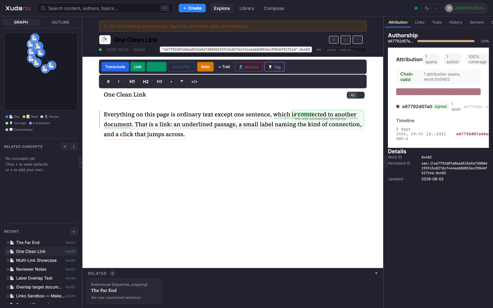
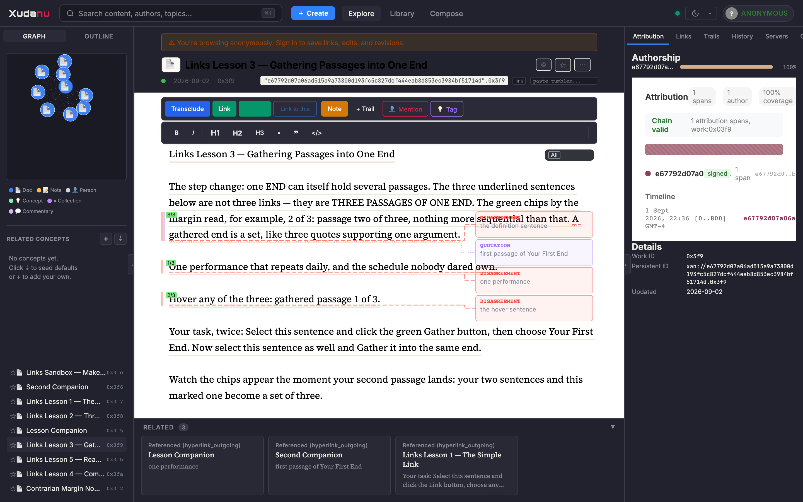
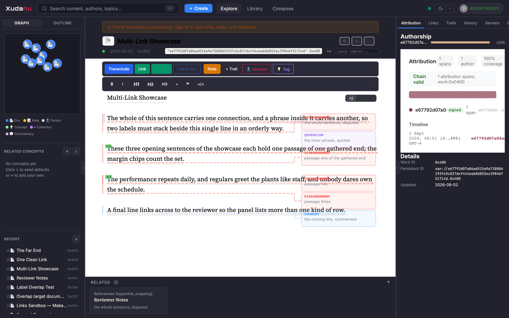
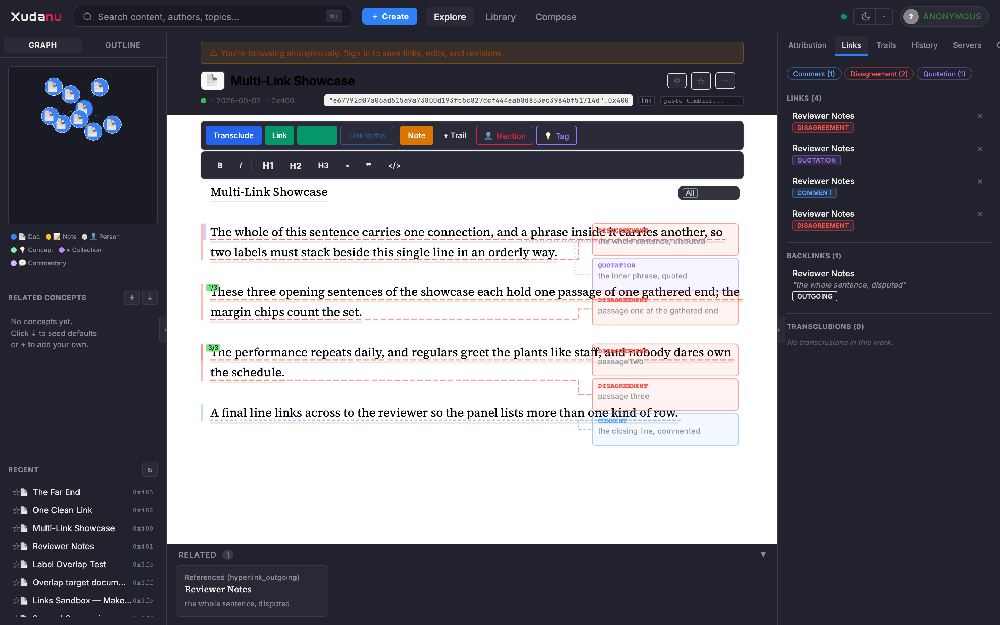

# Xudanu Links — A Visual Introduction

*Captured from the running application. Each frame shows one
concept; the complex cases come last.*

---

## 1. One link

The whole primitive: an **underlined passage** connected to a
passage in another document, with a small label at the line's end
naming the **kind** of connection (here, Reference). Click the
underline to jump to the far end; hover it for the type and the
target. Everything below is built from these.

## 2. One gathered end — many passages, one side of one link

The step change: a single END of a single link can hold several
passages. The three underlined sentences here are not three links
— they are **three passages of one end**, shown in one shared
colour, each counted by the small green chips beside the margin
(`1 of 3`, `2 of 3`, `3 of 3` — position in the set, nothing more
sequential than that). A gathered end is a set, like three quotes
supporting one argument. In this frame the end belongs to a
Disagreement: one connection claiming several passages at once.

## 3. The same, hovered

Hovering any member passage names the connection and says which
piece of the set you are looking at — *gathered passage 2 of 3* —
and highlights its siblings. With the caret inside a member, the
bottom bar offers numbered jumps between passages of the set.

## 4. Links interacting — the honest complex case

Two connections sharing one line (a full sentence, and a phrase
inside it), plus a gathered end below, plus the margin chips: this
is what several links look like when they genuinely interact. It
is dense — to an untrained eye, genuinely hard — which is why the
labels stack in a fixed order with clear gaps, and why the next
frame matters.

## 4b. The same frame, one connection hovered

The fix for that density: **hover any connection and every other
link dims away** — its underline, its labels, its margin marks —
leaving the hovered link, and for gathered ends *all* its member
passages, standing alone against a quieted page. The density
stays; the confusion goes.

## 5. The Links panel — the legend

The right-hand Links panel lists every connection touching the
document, one row each: type badges, how many passages a gathered
end holds (`3 passages`), attachments to other connections
(`→ connection`), and actions — retype, comment *on the
connection*, compare all ends side by side. When the canvas feels
dense, this panel is the readable legend.

---

*The interactive versions of all of this live in the Links Course
(five progressive lessons) and the Links Playground in the
application itself.*
