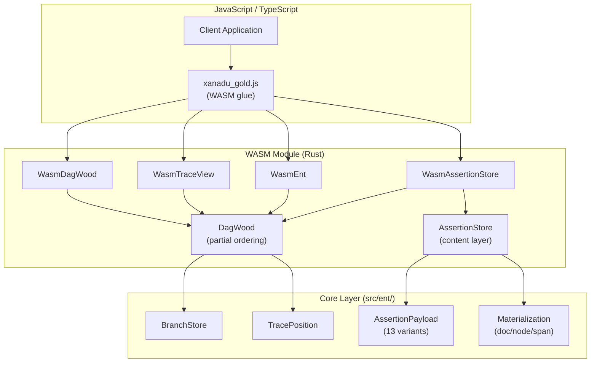
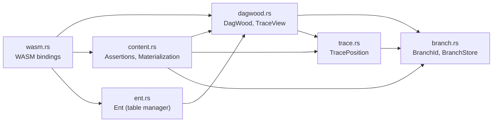
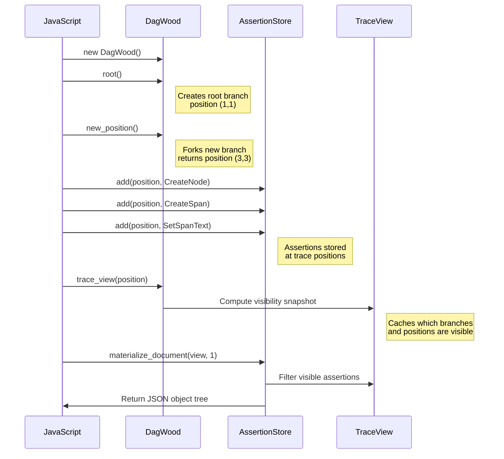
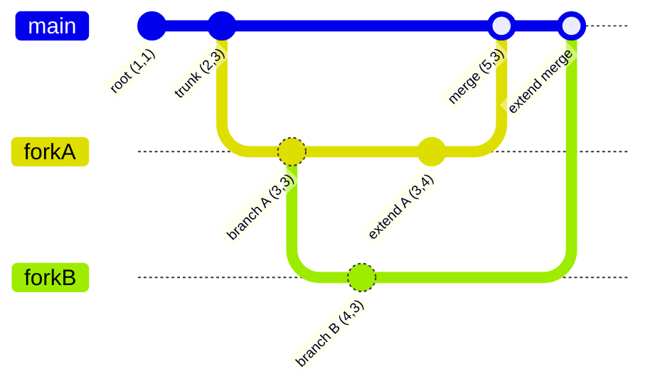
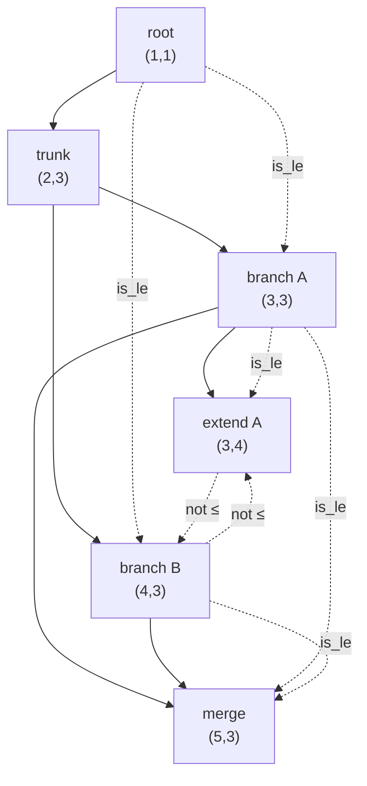
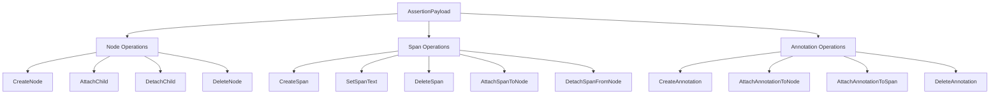
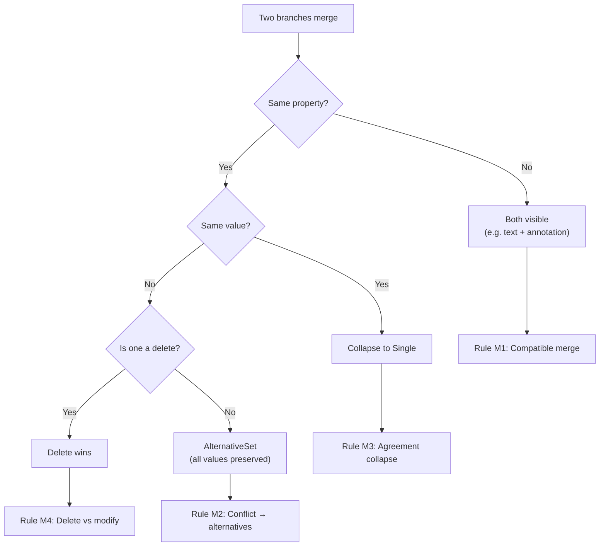
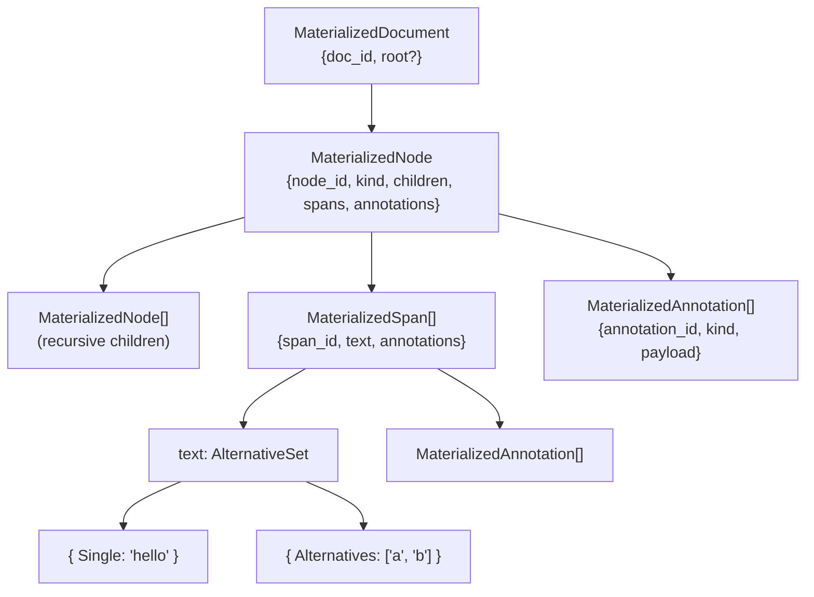
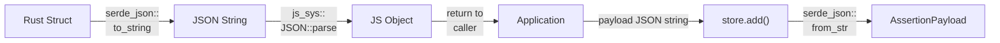

# Architecture

## System Overview

Xanadu Gold is a Rust library that compiles to WebAssembly for browser and
Node.js consumption. It implements the Xanadu hypertext model: a
conflict-preserving content-addressable document store built on a partially
ordered trace history.

## Module Dependencies

## Data Flow: Document Lifecycle

## Data Flow: Fork and Merge

The partial ordering after this sequence:

## AssertionPayload Variants

All 13 operations that modify document content:

## Merge Semantics

When branches diverge and merge, the content layer follows these rules:

## Materialized Document Tree

## WASM Serialization Path

This path avoids BigInt issues (u64 → regular JS Number) and produces
standard JSON compatible with all network protocols.
