# Notification System

## Overview

Xudanu implements a multi-layered notification architecture that lets clients
observe changes to documents, content matches across works, and real-time
collaborative editing sessions. The system combines three distinct notification
mechanisms, each designed for a different use case:

| Mechanism | Scope | Delivery | Use Case |
|-----------|-------|----------|----------|
| **Detector Events** | Per-work or per-edition | Push via event channel | Status, revision, fill |
| **Content Watch** | Cross-work content matching | Drain on request + push | Transclusion detection |
| **CRDT Relay** | Per-work collaborative | Response-embedded relay | Real-time co-editing |

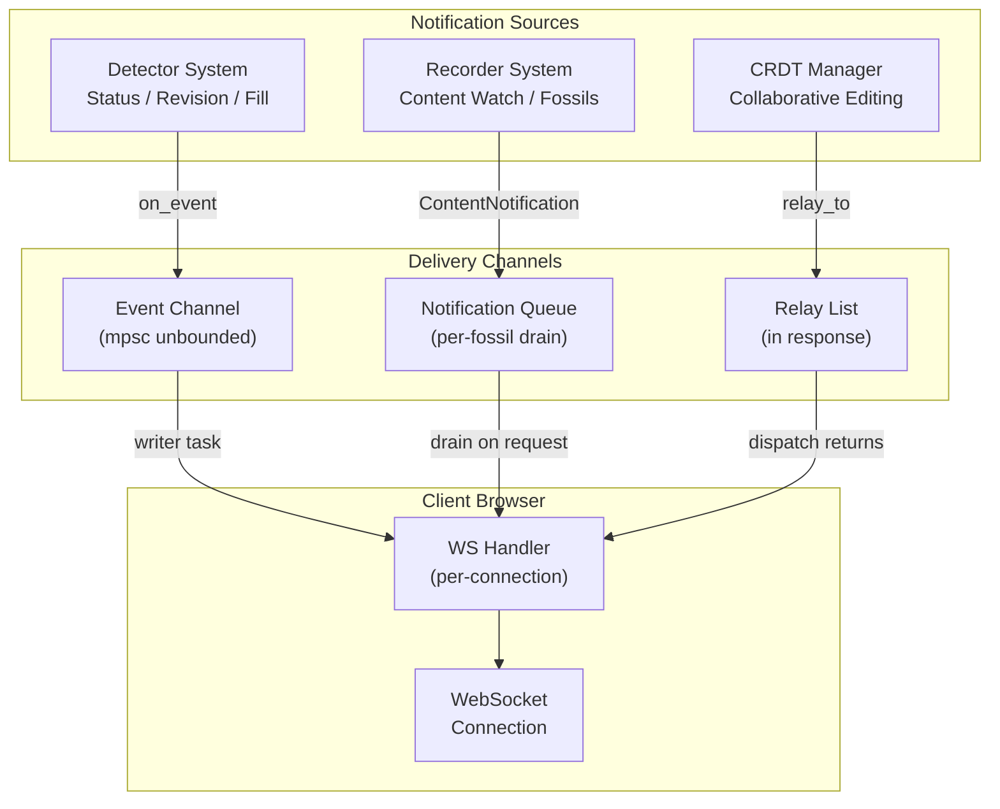

---

## 1. Detector Events

Detectors are the original notification mechanism, modelled after the Udanax
Gold observer pattern. A client subscribes to a specific work or edition and
receives push events whenever that target changes.

### Detector Types

| Type | Scope | Event | Code |
|------|-------|-------|------|
| `Status` | Per-work | `WorkGrabbed`, `WorkReleased` | `0x01`, `0x02` |
| `Revision` | Per-work | `WorkRevised` | `0x03` |
| `Fill` | Per-edition | `RangeFilled`, `ElementFilled` | `0x04`, `0x05` |

### How It Works

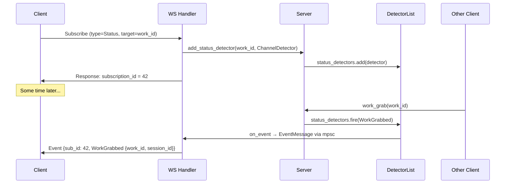

The `ChannelDetector` bridges the synchronous server core and the async
WebSocket handler. When the server fires an event, the detector pushes an
`EventMessage` into an unbounded `mpsc` channel. A dedicated writer task
on the async side picks up these messages and writes them to the WebSocket.

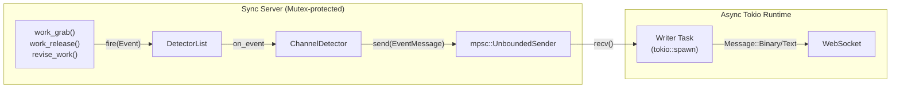

### Server-Side Event Firing Points

Events are fired at specific mutation points in `server.rs`:

| Event | When Fired | File Location |
|-------|-----------|---------------|
| `WorkGrabbed` | `work_grab()` succeeds | `server.rs:599` |
| `WorkReleased` | `work_release()` succeeds | `server.rs:639` |
| `WorkReleased` | `disconnect()` releases grabbed works | `server.rs:333` |
| `WorkRevised` | `revise_work()` after edition update | `server.rs:537` |

### Subscription Lifecycle

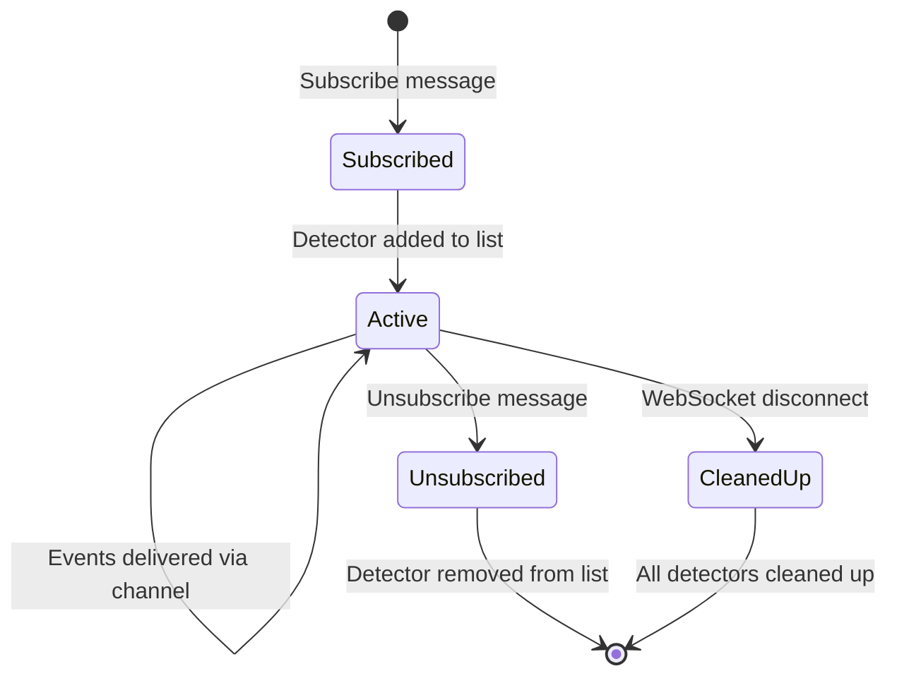

### Code: Subscribing to Status Changes (JavaScript)

```javascript
// Subscribe to work status changes (grab/release)
var subId = null;

function subscribeStatus(workId) {
  var id = nextId();
  ws.send(JSON.stringify({
    v: 2, type: 'subscribe', id: id,
    payload: { detector_type: 'status', target_id: workId }
  }));
  // Response will contain the subscription_id
}

// Handle incoming events
ws.onmessage = function(msg) {
  var data = JSON.parse(msg.data);
  if (data.type === 'event') {
    var event = data.event;
    if (event.type === 'work_grabbed') {
      console.log('Work grabbed by session', event.payload.session_id);
    } else if (event.type === 'work_released') {
      console.log('Work released');
    }
  } else if (data.type === 'response' && data.id === subscribeId) {
    subId = data.value;  // Store subscription_id for unsubscribe
  }
};

// Clean up
function unsubscribe() {
  if (subId) {
    ws.send(JSON.stringify({ v: 2, type: 'unsubscribe', id: subId }));
    subId = null;
  }
}
```

---

## 2. Content Watch Notifications

Content Watch is the newest notification mechanism, added to enable real-time
detection of transclusive relationships between documents. When a user clicks
"Watch" on a document, the server monitors for any other documents that share
content with it — both past matches that already exist and future matches that
appear as new documents are created or edited.

### Why It Exists

Traditional hypertext systems require users to actively search for shared
content. Content Watch flips this: the server proactively notifies you when
your content appears elsewhere. This is the Xanadu vision of automatic
attribution and connection.

### Architecture

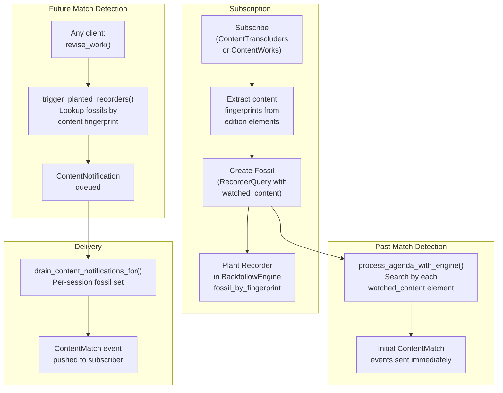

### The Fingerprint Index

The key data structure enabling content watch is `fossil_by_fingerprint`, a
reverse index in the `BackfollowEngine`:

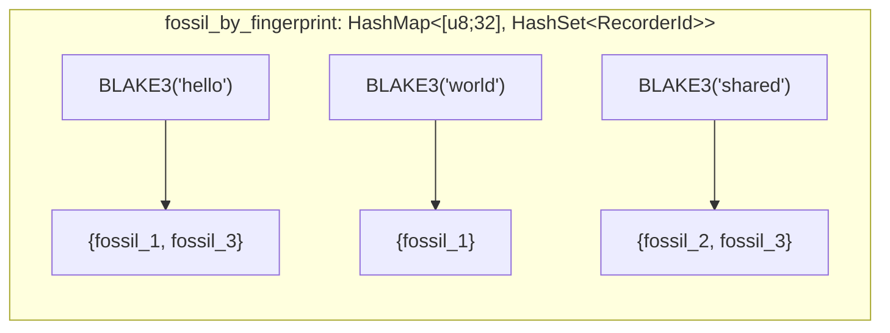

When a recorder is planted, each content element's BLAKE3 fingerprint is
mapped to the fossil ID. When any edition is revised, the new fingerprints
are looked up in this index to find affected fossils in O(1) per element.

### Per-Session Notification Drain (Enhanced)

A critical improvement made during development: notification draining is
**per-session**, not global. Each client only drains notifications for its
own fossils:

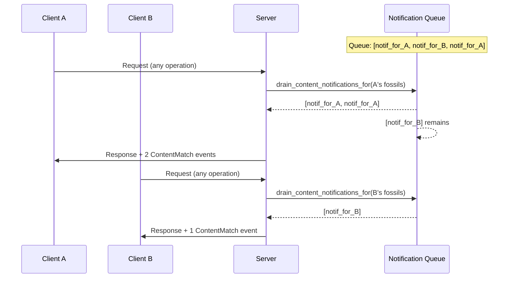

This prevents Client A from accidentally consuming Client B's notifications.

### Subscription Cleanup (Enhanced)

Unsubscribe now properly cleans up all tracking state:

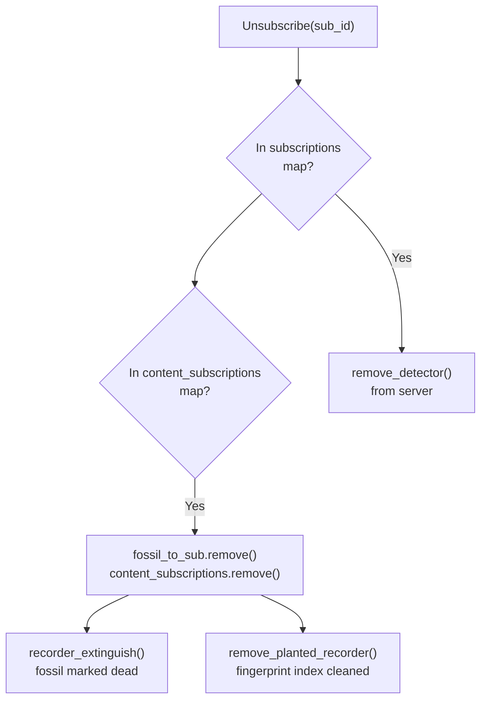

Without this fix, fossils would remain planted and continue consuming
resources on every `revise_work()` call.

### Code: Setting Up Content Watch (JavaScript)

```javascript
var watchSubId = null;
var watchResults = [];

function startWatch(workId) {
  var id = nextId();
  ws.send(JSON.stringify({
    v: 2, type: 'subscribe', id: id,
    payload: {
      detector_type: 'content_transcluders',
      target_id: workId
    }
  }));
}

// In your message handler:
if (msg.type === 'event' && msg.event.type === 'content_match') {
  var p = msg.event.payload;
  watchResults.push({
    edition_be_id: p.edition_be_id,
    is_direct: p.is_direct,
    fossil_id: p.fossil_id
  });
  console.log('Found matching content in edition ' +
    p.edition_be_id.toString(16) +
    (p.is_direct ? ' (direct)' : ' (indirect)'));
}

function stopWatch() {
  if (watchSubId) {
    ws.send(JSON.stringify({
      v: 2, type: 'unsubscribe', id: watchSubId
    }));
    watchSubId = null;
  }
}
```

### Code: Server-Side Fossil Lifecycle (Rust)

```rust
// Subscription: plant_recorder in BackfollowEngine
pub fn plant_recorder(&mut self, edition_id: u64, fossil_id: RecorderId,
                      content: &[RangeElement]) {
    // 1. Mark the edition's sensor crum as having a recorder
    if let Some(meta) = self.edition_metas.get(&edition_id) {
        let scrum = meta.sensor_crum();
        scrum.lock().unwrap().install_recorders(&[fossil_id]);
        propagate_flags(scrum);  // IS_SENSOR_WAITING propagates up
    }
    // 2. Build reverse fingerprint index
    for elem in content {
        let fp = elem.content_fingerprint();
        self.fossil_by_fingerprint.entry(fp).or_default().insert(fossil_id);
    }
}

// Triggering: check_recorders_by_content
pub fn check_recorders_by_content(&self, fingerprints: &[[u8; 32]])
                                  -> Vec<RecorderId> {
    let mut seen = HashSet::new();
    let mut results = Vec::new();
    for fp in fingerprints {
        if let Some(fossil_ids) = self.fossil_by_fingerprint.get(fp) {
            for &fossil_id in fossil_ids {
                if seen.insert(fossil_id) {
                    results.push(fossil_id);
                }
            }
        }
    }
    results
}
```

---

## 3. CRDT Collaborative Relay

The CRDT (Conflict-free Replicated Data Type) system uses a fundamentally
different notification model: relay. When one client edits a shared document,
the server applies the change and returns a list of other subscribers who
need to be notified.

### How It Differs from Detectors

| Aspect | Detector Events | CRDT Relay |
|--------|----------------|------------|
| Channel | mpsc event channel | Returned in response |
| Encoding | EventPayload enum | Raw Yjs update bytes |
| Scope | Any subscriber | Same-document subscribers |
| Delivery | Async writer task | Client polls via CrdtSyncDiff |

### Relay Flow

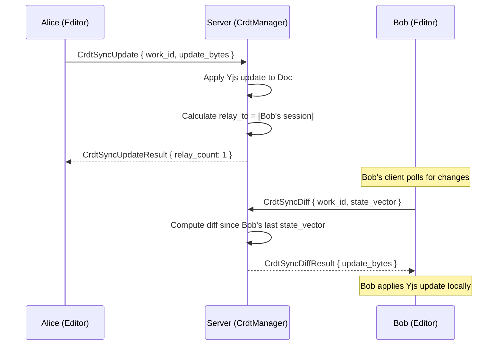

The relay mechanism is intentionally **pull-based** from the receiving client's
perspective. The server doesn't push updates to Bob; instead, Bob's client
periodically calls `CrdtSyncDiff` to fetch changes since its last known state.

### CRDT Awareness

In addition to document content, the CRDT system relays awareness state
(cursor positions, selections, typing indicators):

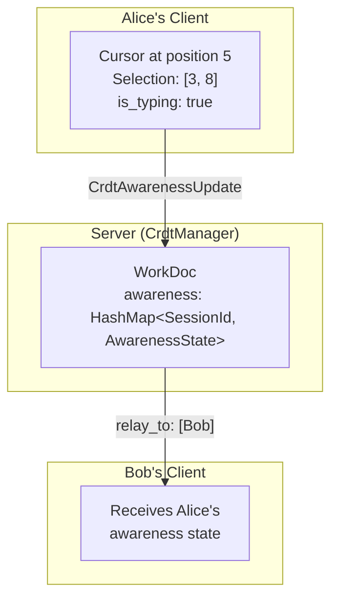

### Code: Collaborative Editing Session (JavaScript)

```javascript
// Open CRDT sync session
ws.send(JSON.stringify({
  v: 2, type: 'request', id: nextId(),
  op: 'crdt_sync_open',
  payload: { work_id: workId }
}));
// Response: { state_vector: [...], current_text: "hello world" }

// Send edits
ws.send(JSON.stringify({
  v: 2, type: 'request', id: nextId(),
  op: 'crdt_sync_update',
  payload: { work_id: workId, update: Array.from(updateBytes) }
}));
// Response: { relay_count: 2 }  // 2 other editors will see this

// Poll for changes from other editors
ws.send(JSON.stringify({
  v: 2, type: 'request', id: nextId(),
  op: 'crdt_sync_diff',
  payload: { work_id: workId, state_vector: Array.from(myStateVector) }
}));
// Response: { update: [...] }  // Apply Yjs update locally

// Send awareness (cursor position)
ws.send(JSON.stringify({
  v: 2, type: 'request', id: nextId(),
  op: 'crdt_awareness_update',
  payload: {
    work_id: workId,
    state: {
      session_id: mySessionId,
      user_name: "Alice",
      cursor: { index: 5 },
      selection: null,
      is_typing: true
    }
  }
}));
```

---

## 4. Wire Protocol: Event Messages

All notification types share a common wire format. Events are delivered as
WebSocket messages with the `Event` message type (`0x04`).

### Binary Frame Layout

```
┌──────┬──────┬───────────────┬──────────────┬──────────────────┐
│ 0x02 │ 0x04 │ subscription  │ event_code   │ event payload    │
│ ver  │ type │ id (2 bytes)  │ (1 byte)     │ (postcard)       │
└──────┴──────┴───────────────┴──────────────┴──────────────────┘
```

### Event Codes

| Code | Event | Payload |
|------|-------|---------|
| `0x01` | `WorkGrabbed` | `{ work_be_id, session_id }` |
| `0x02` | `WorkReleased` | `{ work_be_id, session_id }` |
| `0x03` | `WorkRevised` | `{ work_be_id, revision, session_id }` |
| `0x04` | `RangeFilled` | `{ edition_be_id, region }` |
| `0x05` | `ElementFilled` | `{ element_be_id }` |
| `0x06` | `Done` | `{ operation_id }` |
| `0x07` | `ContentMatch` | `{ fossil_id, edition_be_id, is_direct }` |

### JSON Format

```json
{
  "v": 2,
  "type": "event",
  "id": 42,
  "event": {
    "type": "content_match",
    "payload": {
      "fossil_id": 7,
      "edition_be_id": "0000000000abc123",
      "is_direct": true
    }
  }
}
```

---

## 5. Handler State Management

The WS handler maintains three maps to track subscriptions across
notification types:

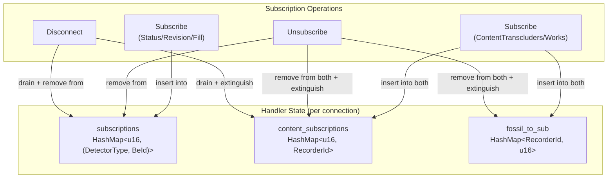

### Cleanup on Disconnect

When a WebSocket closes, the handler performs complete cleanup:

```rust
// 1. Remove all detector subscriptions
for (sub_id, (det_type, target_id)) in subscriptions.drain() {
    srv.remove_detector(det_type, target_id, sub_id);
}

// 2. Extinguish all content watch fossils
for (_sub_id, fossil_id) in content_subscriptions.drain() {
    srv.recorder_extinguish(fossil_id);
}

// 3. Close server session (releases grabbed works)
srv.disconnect(session_id);
```

---

## 6. Message Flow: Complete Picture

The following diagram shows how all three notification mechanisms interact
during a typical editing session:

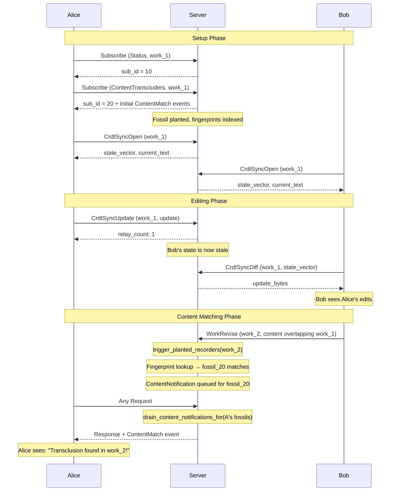

---

## 7. Enhancements and Improvements

The notification system has been significantly improved over the original
Udanax Gold design. Here is a summary of what was enhanced:

### Per-Session Notification Drain

**Problem:** The original `drain_content_notifications()` used
`std::mem::take` to drain ALL pending notifications from the global queue.
In a multi-client scenario, whichever client sent a request first would
consume all notifications, including those intended for other clients.

**Fix:** `drain_content_notifications_for()` now takes a
`HashSet<RecorderId>` of the calling session's fossils. It partitions the
queue: matching notifications are returned, non-matching are left for their
rightful recipients.

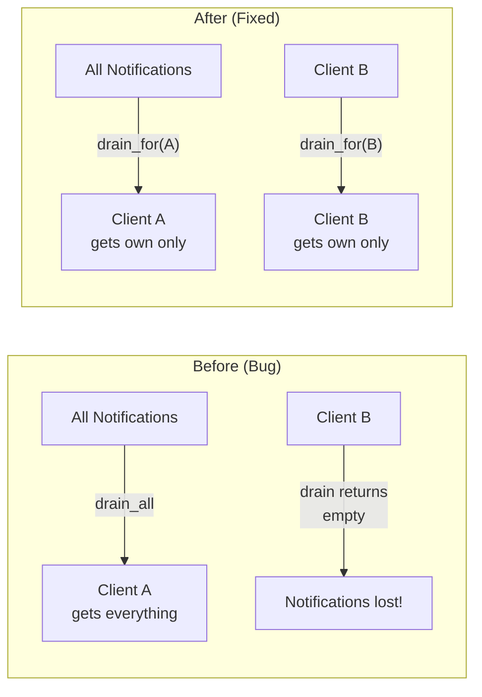

### Complete Unsubscribe Cleanup

**Problem:** The `Unsubscribe` handler only removed entries from the
`subscriptions` map. Content subscriptions in `content_subscriptions` and
`fossil_to_sub` were never cleaned up on explicit unsubscribe. Fossils
remained planted, consuming CPU on every `revise_work()`.

**Fix:** The handler now checks both maps and calls `recorder_extinguish()`
to properly kill the fossil and `remove_planted_recorder()` to clean up the
fingerprint index.

### Fingerprint-Based Triggering

**Problem:** The original design used canopy walking to find affected
recorders, which would traverse the entire edition hierarchy for every edit.

**Fix:** `check_recorders_by_content()` uses the `fossil_by_fingerprint`
reverse index for O(1) lookup per content element, skipping canopy traversal
entirely.

### Content-Aware Past Match Search

**Problem:** Past matches only searched by edition ID reference, not by
actual content elements.

**Fix:** `process_agenda_with_engine()` now iterates over
`watched_content: Vec<RangeElement>`, searching for each content element
independently. This finds transcluders based on shared content, not just
structural references.

---

## 8. Known Limitations

### Content Notifications Are Piggyback-Only

Content notifications are only drained when a client sends a regular `Request`
message. An idle client that never sends requests will not receive
notifications. This is tracked in `TODO.md`.

**Potential fix:** Implement server-push via periodic flush or a notification
channel per session.

### CRDT Updates Are Pull-Based

CRDT updates rely on the receiving client polling via `CrdtSyncDiff`. There
is no server-push mechanism for CRDT changes. Clients must implement their
own polling interval (typically 50-100ms during active editing).

### No Notification Persistence

If a client disconnects, any pending content notifications are lost. There
is no mechanism to replay missed notifications on reconnect.

---

## 9. Quick Reference

### Subscribe Message (JSON)

```json
{
  "v": 2,
  "type": "subscribe",
  "id": 15,
  "payload": {
    "detector_type": "content_transcluders",
    "target_id": "0000000042a1b2c3"
  }
}
```

### Unsubscribe Message (JSON)

```json
{
  "v": 2,
  "type": "unsubscribe",
  "id": 15
}
```

### Detector Type Codes

| DetectorType | Binary | JSON string |
|-------------|--------|-------------|
| Status | `0x01` | `"status"` |
| Revision | `0x02` | `"revision"` |
| Fill | `0x03` | `"fill"` |
| ContentTranscluders | `0x04` | `"content_transcluders"` |
| ContentWorks | `0x05` | `"content_works"` |

### Key Source Files

| File | Purpose |
|------|---------|
| `src/server/detector.rs` | Event enum, Detector trait, DetectorList |
| `src/server/transport/channel.rs` | ChannelDetector (sync → async bridge) |
| `src/server/transport/handler.rs` | WS handler: subscribe/unsubscribe/drain |
| `src/server/transport/protocol.rs` | DetectorType, EventPayload, EventCode |
| `src/server/server.rs` | Server: fire events, trigger recorders, drain notifications |
| `src/edition/recorder.rs` | RecorderSystem, Fossil, RecorderQuery |
| `src/edition/backfollow.rs` | BackfollowEngine, fingerprint index, plant/check recorders |
| `src/server/crdt_manager.rs` | CRDT: relay, awareness, materialization |
